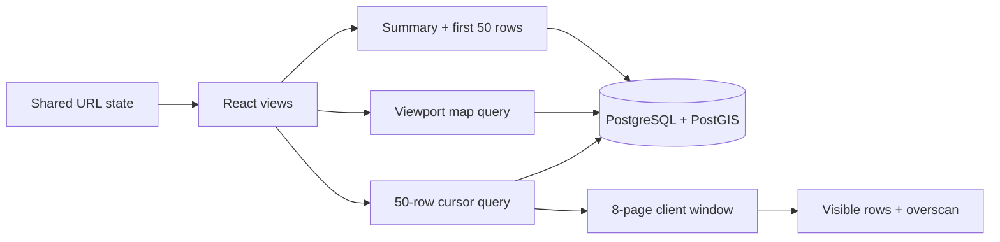

# NYC Service Pulse: keeping a large dataset out of the render loop

[Live application](https://nyc-service-pulse.vercel.app) · [Source](https://github.com/crispyb0i/nyc-service-pulse) · [Demo walkthrough](demo-walkthrough.md)

NYC Service Pulse explores **328,892 service requests** created during August 2026. The challenge was to make an exact, transparent view of the data feel responsive while retaining useful detail, keyboard access, and shareable exploration state.

The browser never receives the whole dataset. PostgreSQL/PostGIS answers bounded queries; React renders aggregates, the current map viewport, and a small request window. The public demo uses Next.js, React, TypeScript, Leaflet, TanStack Virtual, Neon and Vercel.

## The problem that the measurements exposed

The original table reused the dashboard endpoint for every page. Asking for the next 50 records also recalculated the exact closure median, daily chart, totals and provenance. The dashboard marked its entire data section busy during each request, and the map mounted only after the summary returned. The table already used keyset pagination, but the endpoint and UI boundaries prevented it from delivering its full benefit.

The changes separate those responsibilities:

| Concern | Implementation | Bound or guarantee |
| --- | --- | --- |
| Overview | Exact summary, daily aggregates and first-page seed in one repeatable-read transaction | 31 daily values and 50 records |
| Page turns | Dedicated `/api/requests` query ordered by timestamp and ID | Reads 51 rows to return 50 plus a cursor; no aggregate queries |
| Continuous browsing | Fixed-height virtualization, overscan and page eviction | At most 8 pages / 400 records in the navigation cache |
| Map | Viewport query, stable geographic grid, sparse point detail | At most 400 aggregate cells or 100 complete individual points |
| Async state | Independent loading/error boundaries, abort controllers, request keys | Late responses cannot replace a newer selection |
| Navigation | Validated URL state and native history | Filters, area, camera, selected request and page survive reload/Back |
| Accessibility | Native controls and table, keyboard list navigation, focus return, explicit statuses | Virtual browsing is optional; paged reading remains available |



Street tiles load independently, with attribution and a local-geography fallback for failures/timeouts. Building footprints provide context; they do not increase the precision of the source coordinates. Clicking a chart day filters the shared dates. “Search this area” explicitly narrows the request list; moving the map alone does not silently change list membership or citywide metrics.

## Measured results

| Profile / observation | Before | Final |
| --- | ---: | ---: |
| Desktop: page turn | 856.1 ms | 109.1 ms |
| Desktop: first navigation | 1,896.8 ms | 2,205.3 ms |
| Desktop: repeat navigation | 1,434.5 ms | 2,163.9 ms |
| Desktop: observed event p95 | 72.0 ms | 48.0 ms |
| Desktop: rAF interval p95 | 16.7 ms | 16.7 ms |
| Constrained mobile: page turn | 957.4 ms | 405.9 ms |
| Constrained mobile: first navigation | 4,643.8 ms | 6,055.4 ms |
| Constrained mobile: repeat navigation | 4,488.9 ms | 3,252.4 ms |
| Constrained mobile: observed event p95 | 152.0 ms | 80.0 ms |
| Constrained mobile: rAF interval p95 | 16.8 ms | 33.3 ms |

These are medians across three runs per profile, not pooled field percentiles. Each page-turn figure is the median of three five-page medians. The request trace changes from `/api/pulse` to `/api/requests` for every measured page turn. **Page turns improve substantially; first navigation is slower in both profiles in these samples.** Parallel data work, extra client code, proximity/scroll behavior and server variability all remain relevant; this experiment does not isolate each contribution. The constrained mobile rAF p95 is also higher, so there is no universal smoothness/FPS claim. The sampling window includes API waits and is shorter after the change.

The first after run exposed a large layout jump (roughly 0.32 from one shift). The final version reserves the chart/card geometry and keeps the paged viewport height stable. Final desktop windowed CLS across the recorded sequence is 0.020; the new regression also checks that summary arrival moves the map by at most 2 px. The original baseline had lower layout shift overall, so this is a corrected regression rather than an improvement claim over the baseline.

[Comparison and calculation method](../reports/portfolio/comparison.json) · [Baseline](../reports/portfolio/before/performance.json) · [First after run, including regression](../reports/portfolio/after/performance.json) · [Final raw runs](../reports/portfolio/after-stable-layout/performance.json) · [Final Chrome timeline](../reports/portfolio/after-stable-layout/chrome-trace.json) · [Verification record](../reports/portfolio/verification.md)

The before and after runs use the same production-localhost observation protocol and imported snapshot. Each profile has three independent browser contexts, each with a fresh and repeated browser navigation and five page turns. Desktop uses a 1440 × 1000 viewport. The constrained mobile profile uses a 390 × 844 viewport, 4× CPU slowdown, 100 ms simulated latency, 1.6 Mbps download and 0.75 Mbps upload. It is desktop Chrome emulating constraints, not a physical phone.

The database is the same local PostGIS container throughout: AMD64 on an ARM Mac, limited to 1.5 CPUs and 1 GB RAM. Server/database caches are not reset. The report’s historical `cold-browser` / `warm-browser` labels mean first/repeated navigation within the context. Playwright routing disables the browser HTTP cache, so the repeat is **not an HTTP-cache-hit benchmark**. Host processes are not isolated. Street tiles are intercepted synthetic images so the benchmark does not crawl OpenStreetMap. These conditions do not describe the native Neon deployment; deployed HTTP smoke checks are recorded separately.

Automation settlement includes Playwright dispatch and assertions. Event Timing is quantized and excludes events below the observer threshold; it is not field INP. rAF intervals describe callback scheduling, not presented-frame FPS. Long-task/frame observers and tracing add overhead. The heap-window probe forces GC at several checkpoints, but a short plateau cannot establish that an app is leak-free. Timing claims are limited to the recorded samples.

The continuous-window probe traversed **1,550 records**. At its recorded checkpoints it retained at most **400 records** and mounted at most **14 rows**. The largest page body was **15,020 bytes**. After explicit garbage collection, observed heap was **8.52 MB at 800 records** and **8.66 MB at 1,550**; DOM nodes stayed at 3,393 across those later checkpoints. This bounds retained application data and sampled DOM size, but is not proof of leak-free behavior. [Raw window measurements](../reports/portfolio/window/window.json).

## Tradeoffs and boundaries

- **Exactness has a cost.** Full-month exact medians still scan data. Page turns avoid that work; they do not make it free. A much larger or live cohort should compare materialized aggregates and their invalidation costs using fresh measurements.
- **Cache bounds are deliberate.** Pages are reused for 60 seconds and evicted beyond eight entries. This is a client navigation cache, not a server freshness contract. Each page has its own database snapshot; browsing across an import refresh is not a single frozen transaction.
- **A continuous list needs a reading alternative.** Virtual rows are not all present in the accessibility tree. The native paged table, stable ordering, explicit loaded-window instructions, arrow-key navigation, focus retention and accessible map list provide alternate routes through the same records. Automated axe checks and keyboard regressions do not replace testing with actual screen-reader users.
- **No browser worker was needed for the data path.** Aggregation happens next to the indexed data. Moving hundreds of thousands of records into a browser worker would introduce transfer and memory costs that the bounded API avoids.
- **The measurements are local lab evidence.** Shared-runner CI enforces deterministic cache, DOM and payload bounds. It does not claim a universal timing SLA from a noisy runner. Free cloud infrastructure can impose limits and cold-start delays.
- **The source is mutable.** Records without coordinates stay in totals and unscoped tables. Spatial selections exclude them explicitly. Original floating timestamps and data-quality flags are retained. Source “Closed” does not prove that a resident’s problem was resolved.

## Verification and delivery

TypeScript and production builds pass. Unit tests cover validation, cursor scope, import normalization and URL round-trips. Five real PostgreSQL/PostGIS integration tests use temporary tables or test-owned sessions, including lost-connection recovery, rollback and bidirectional microsecond keysets. All 28 browser checks pass and exercise cancellation, deep links, history, local retries, map outage fallbacks, continuous scrolling bounds and automated WCAG A/AA scans at desktop/mobile widths.

The lint run exits successfully with one known `react-hooks/incompatible-library` warning for TanStack Virtual’s instance API. React Compiler is not enabled, and the instance is consumed within its component; it is not passed into memoized children. The warning is retained rather than suppressing the rule.

GitHub Actions builds a production app against 6,200 synthetic CI records and runs the full suite. Browser evidence is uploaded as artifacts. The deployed snapshot contains the same 328,892 records, with 322,590 mapped records. A separate Neon app role can SELECT the two required tables and was verified to reject a no-op write. TLS hostname verification and pooled connections are configured; administrative credentials are kept out of the application and repository.

The pre-change application is preserved at the `portfolio-before` Git tag, including the same measurement harness. To reproduce, create a separate worktree at that tag, install its locked dependencies, supply the local database environment, and build/start it. Stop the other app using port 3100 before switching versions. Then run:

```sh
node scripts/measure-performance.mjs --label my-before --samples 3 --trace
```

Run the same command with a new label on the current version, then:

```sh
npm run measure:window -- --label my-window
```

The final CLS calculation uses session windows; early raw summaries had labeled the sum of all shifts as `cls`. The comparison recomputes both versions from the raw events, without altering the originals.

Use fresh labels: reports are never silently overwritten. The raw measurements, traces, intermediate failed test reports and explanations are retained alongside the final results. Public UI screenshots use real tiles; automated tests use synthetic tiles.

## Source references

[NYC 311 source](https://data.cityofnewyork.us/Social-Services/311-Service-Requests-from-2020-to-Present/erm2-nwe9) · [TanStack Virtual](https://tanstack.com/virtual/latest/docs/framework/react/react-virtual) · [Neon PostGIS support](https://neon.com/docs/extensions/postgis) · [Neon pooling](https://neon.com/docs/connect/connection-pooling) · [OpenStreetMap tile policy](https://operations.osmfoundation.org/policies/tiles/)
